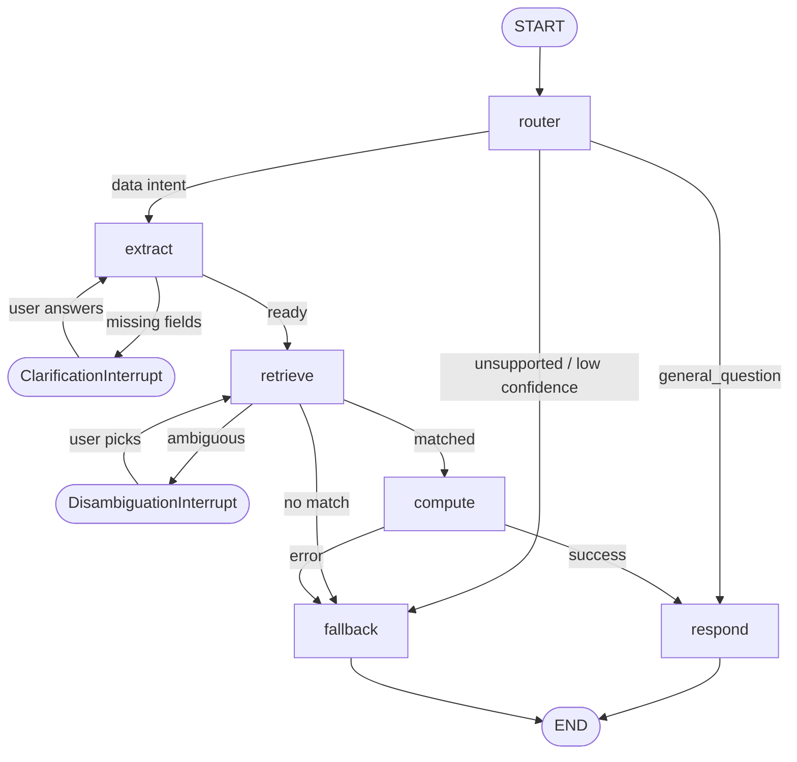

# Real Estate Asset Multi-Agent Portfolio Assistant

A stateful **LangGraph multi-agent system** that answers natural-language questions about a real-estate portfolio P&L ledger.

---

## Quick Start

### 1. Install dependencies

```bash
python -m venv .venv && source .venv/bin/activate
pip install -r requirements.txt
```

### 2. Set your LLM API key

```bash
# Anthropic (default)
export ANTHROPIC_API_KEY=sk-ant-...

# Or OpenAI
export OPENAI_API_KEY=sk-...
export LLM_PROVIDER=openai
export LLM_MODEL=gpt-4o-mini
```

Or create a `.env` file:
```
ANTHROPIC_API_KEY=sk-ant-...
```

### 3. Run the Streamlit app

```bash
streamlit run src/app.py
```

### 4. Run tests

```bash
pytest tests/ -v
```

---

## Dataset

File: `cortex (2) (1) (2) (1) (1) (3).parquet`

| Column | Description |
|---|---|
| `entity_name` | Legal entity (PropCo) |
| `property_name` | Building name (Building 120, 140, 160, 17, 180) |
| `tenant_name` | Tenant name (Tenant 1–18); NaN for entity-level entries |
| `ledger_type` | `revenue` or `expenses` |
| `ledger_group` | rental_income, general_expenses, management_fees, … |
| `ledger_category` | revenue_rent_taxed, bank_charges, … |
| `ledger_code` | Numeric code (e.g. 4800) |
| `ledger_description` | Bilingual free-text description |
| `month` | `YYYY-MXX` (e.g. `2024-M06`) |
| `quarter` | `YYYY-QX` (e.g. `2024-Q3`) |
| `year` | `YYYY` |
| `profit` | Signed float — positive=income, negative=expense |

**Coverage:** 2024 full year + 2025 Q1. Entity: PropCo only.

> **This dataset does NOT contain property valuations, market prices, appraisals, or addresses.**

---

## Architecture

```
User Query
    │
    ▼
┌─────────┐   unsupported / low-conf   ┌──────────┐
│ Router  │──────────────────────────► │ Fallback │─► END
│  Agent  │   general_question         └──────────┘
└────┬────┘──────────────────────────────────────────► Respond ─► END
     │ data intent
     ▼
┌─────────┐  missing fields
│ Extract │──[interrupt]──► ClarificationInterrupt
│  Agent  │◄──[resume]─────────────────────────────
└────┬────┘
     │
     ▼
┌──────────┐  no match / ambiguous
│ Retrieve │──[interrupt/fallback]─► Fallback / DisambiguationInterrupt
│  Agent   │
└─────┬────┘
      │
      ▼
┌──────────┐  error     ┌──────────┐   ┌─────────┐
│ Compute  │──────────► │ Fallback │   │ Respond │─► END
│  Agent   │            │  Agent   │   │  Agent  │
└──────────┘            └──────────┘   └─────────┘
```

## LangGraph Workflow (Mermaid)



---

## Agents

| Agent | Type | Responsibility |
|---|---|---|
| **RouterAgent** | LLM | Classify intent + confidence |
| **ExtractionAgent** | LLM + heuristic | Extract targets, timeframe, filters; interrupt for missing fields |
| **RetrievalAgent** | Deterministic | Fuzzy name resolution + DataFrame query; interrupt for disambiguation |
| **ComputationAgent** | Deterministic | Pandas aggregation — no LLM math |
| **ResponseAgent** | LLM | Format computation results into concise prose |
| **FallbackAgent** | LLM | Unsupported / no-match / errors; one clarifying question |

---

## Supported Intents

| Intent | Example Query |
|---|---|
| `pnl_total` | "What is the total profit for 2024?" |
| `pnl_by_property` | "Show profit by property for Q1 2025" |
| `pnl_by_tenant` | "Revenue per tenant in 2024" |
| `breakdown` | "Break down expenses by ledger group for 2024" |
| `comparison` | "Compare Building 140 vs Building 160 for 2024" |
| `ranking` | "Top 5 properties by profit in 2024" |
| `general_question` | "What is NOI in real estate?" |
| `unsupported` | "What is Building 140 worth?" |

---

## Error Handling

1. LLM structured output fails → heuristic keyword fallback
2. JSON parse error → Pydantic validation with normalisation
3. No fuzzy match → FallbackAgent shows top-3 candidates
4. Ambiguous match → DisambiguationInterrupt, user picks
5. Empty query result → FallbackAgent with filter explanation
6. Node exception → Error caught, routes to FallbackAgent
7. Unsupported intent → FallbackAgent explains + offers alternatives

---

## Golden Test Prompts

```json
[
  {"id": 1, "query": "What is the total profit for 2024?", "expected_intent": "pnl_total"},
  {"id": 2, "query": "Show me profit by property for Q1 2025", "expected_intent": "pnl_by_property"},
  {"id": 3, "query": "Which tenant generated the most revenue in 2024?", "expected_intent": "ranking"},
  {"id": 4, "query": "Compare Building 140 vs Building 160 for 2024", "expected_intent": "comparison"},
  {"id": 5, "query": "Top 5 properties by profit in 2024", "expected_intent": "ranking"},
  {"id": 6, "query": "Bottom 3 tenants by profit last year", "expected_intent": "ranking"},
  {"id": 7, "query": "Break down expenses by ledger type for Q4 2024", "expected_intent": "breakdown"},
  {"id": 8, "query": "What was the rental income for Building 17 in 2024?", "expected_intent": "pnl_total"},
  {"id": 9, "query": "Show profit breakdown by ledger group for 2024", "expected_intent": "breakdown"},
  {"id": 10, "query": "Compare revenue vs expenses for Building 180 in 2024", "expected_intent": "comparison"},
  {"id": 11, "query": "What is YTD profit for 2025?", "expected_intent": "pnl_total"},
  {"id": 12, "query": "What does 'ledger_group' mean in real-estate accounting?", "expected_intent": "general_question"},
  {"id": 13, "query": "What is the market value of Building 140?", "expected_intent": "unsupported"},
  {"id": 14, "query": "How much did Tenant 5 pay in rent in Q2 2024?", "expected_intent": "pnl_total"},
  {"id": 15, "query": "Which building had the highest management fees in 2024?", "expected_intent": "ranking"},
  {"id": 16, "query": "Total revenue for all tenants in Building 160 for 2024", "expected_intent": "pnl_total"},
  {"id": 17, "query": "What is NOI and how is it calculated?", "expected_intent": "general_question"},
  {"id": 18, "query": "Rank all tenants by profit in Q1 2025", "expected_intent": "ranking"},
  {"id": 19, "query": "Show me Q3 2024 expenses broken down by ledger category", "expected_intent": "breakdown"},
  {"id": 20, "query": "What is the address of Building 140?", "expected_intent": "unsupported"}
]
```

---

## Project Structure

```
Real_Estate_Asset_Multi_Agent/
├── src/
│   ├── app.py              ← Streamlit UI
│   ├── graph.py            ← LangGraph StateGraph
│   ├── agents/
│   │   ├── router.py
│   │   ├── extract.py
│   │   ├── retrieve.py
│   │   ├── compute.py
│   │   ├── respond.py
│   │   └── fallback.py
│   ├── tools/
│   │   └── df_tools.py     ← Only interface to the DataFrame
│   └── core/
│       ├── state.py        ← AgentState TypedDict
│       └── schemas.py      ← Pydantic models + system prompts
├── tests/
│   ├── test_tools.py
│   ├── test_compute.py
│   └── test_routing.py
├── requirements.txt
└── README.md
```
